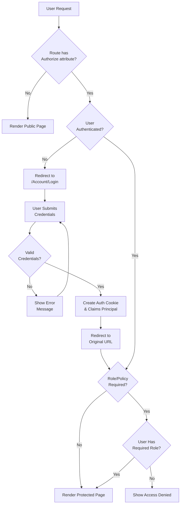

# BlazorAuthApp

A learning demo for scaffolding a **Blazor Server** application with **Interactive Server Render Mode** and **ASP.NET Core Identity** (Individual Accounts) authentication.

## Overview

This application demonstrates how to implement authentication and authorization in a Blazor Server application using ASP.NET Core Identity with Entity Framework Core and SQLite.

## Quick Start

```bash
# Clone the repository
git clone <repository-url>
cd BlazorAuthApp

# Restore dependencies
dotnet restore

# Run the application
dotnet run
```

The application will be available at `https://localhost:5001` or `http://localhost:5000`.

## Project Structure

```
BlazorAuthApp/
├── Components/
│   ├── Account/           # Identity account management pages
│   │   ├── Pages/         # Login, Register, Manage account pages
│   │   └── Shared/        # Shared account components
│   ├── Layout/            # Main layout and navigation
│   ├── Pages/             # Application pages
│   │   ├── Home.razor     # Public home page
│   │   ├── Counter.razor  # Public counter demo
│   │   ├── Weather.razor  # Public weather demo
│   │   ├── Auth.razor     # Requires authentication
│   │   ├── Secure.razor   # Requires authentication
│   │   └── Admin.razor    # Requires Admin role
│   ├── App.razor          # Root component
│   └── Routes.razor       # Router configuration with auth
├── Data/
│   ├── ApplicationDbContext.cs  # EF Core DbContext
│   ├── ApplicationUser.cs       # Custom Identity user
│   └── app.db                   # SQLite database
├── Program.cs             # Application entry point & DI config
└── appsettings.json       # Configuration
```

## How It Works

### Authentication Flow



### Key Components

#### 1. Program.cs Configuration

The application configures several key services:

- **Interactive Server Components**: Enables real-time UI updates via SignalR
- **Cascading Authentication State**: Propagates auth state to all components
- **Identity Core**: User management with Entity Framework stores
- **Cookie Authentication**: Default scheme for persistent sessions

```csharp
builder.Services.AddRazorComponents()
    .AddInteractiveServerComponents();

builder.Services.AddCascadingAuthenticationState();
builder.Services.AddIdentityCore<ApplicationUser>(options => { ... })
    .AddEntityFrameworkStores<ApplicationDbContext>()
    .AddSignInManager()
    .AddDefaultTokenProviders();
```

#### 2. Routes.razor - Authorization Routing

The router wraps all routes with `CascadingAuthenticationState` and uses `AuthorizeRouteView` to enforce authorization:

```razor
<CascadingAuthenticationState>
    <Router AppAssembly="typeof(Program).Assembly">
        <Found Context="routeData">
            <AuthorizeRouteView RouteData="routeData" DefaultLayout="typeof(MainLayout)">
                <NotAuthorized>
                    @if (context.User.Identity?.IsAuthenticated != true)
                    {
                        <RedirectToLogin />
                    }
                    else
                    {
                        <p>You are not authorized to access this resource.</p>
                    }
                </NotAuthorized>
            </AuthorizeRouteView>
        </Found>
    </Router>
</CascadingAuthenticationState>
```

#### 3. Protected Pages

Pages use the `[Authorize]` attribute to require authentication:

```razor
@page "/secure"
@attribute [Authorize]
@rendermode InteractiveServer

<AuthorizeView>
    <Authorized>
        <p>Welcome, @context.User.Identity?.Name!</p>
    </Authorized>
</AuthorizeView>
```

Role-based authorization:

```razor
@page "/admin"
@attribute [Authorize(Roles = "Admin")]
@rendermode InteractiveServer
```

#### 4. Authentication State Revalidation

The `IdentityRevalidatingAuthenticationStateProvider` revalidates the user's security stamp every 30 minutes to ensure the session is still valid:

```csharp
protected override TimeSpan RevalidationInterval => TimeSpan.FromMinutes(30);
```

## Authorization Levels

| Page | Access Level | Description |
|------|--------------|-------------|
| `/` | Public | Home page, accessible to all |
| `/counter` | Public | Counter demo |
| `/weather` | Public | Weather demo |
| `/auth` | Authenticated | Requires login |
| `/secure` | Authenticated | Requires login |
| `/admin` | Admin Role | Requires Admin role |

## Database

The application uses **SQLite** with Entity Framework Core for data persistence:

- Connection string: `DataSource=Data/app.db;Cache=Shared`
- User data stored in ASP.NET Core Identity tables

## Scaffolding Command

This project was created using:

```bash
dotnet new blazor -n BlazorAuthApp -int Server -au Individual
```

Options:
- `-int Server`: Interactive Server render mode
- `-au Individual`: Individual accounts authentication

## Technologies

- **.NET 10.0**
- **Blazor Server** with Interactive Server Render Mode
- **ASP.NET Core Identity**
- **Entity Framework Core** with SQLite
- **Bootstrap 5** for styling

## Further Reading

- [Blazor Authentication and Authorization](https://learn.microsoft.com/en-us/aspnet/core/blazor/security/)
- [ASP.NET Core Identity](https://learn.microsoft.com/en-us/aspnet/core/security/authentication/identity)
- [Blazor Render Modes](https://learn.microsoft.com/en-us/aspnet/core/blazor/components/render-modes)
